aes分为128,192,256bit三种，考试应该只考128，即16字节

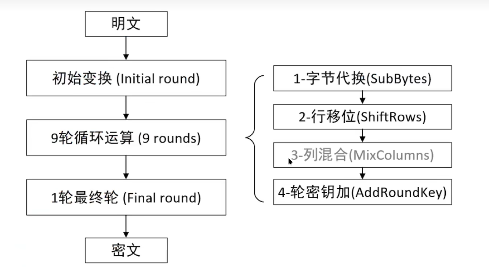

aes整体流程如上，初始变换仅进行轮密钥加，最后一轮不进行列混合  
每轮都会根据初始密钥再生成16字节大小的轮密钥

## 密钥拓展

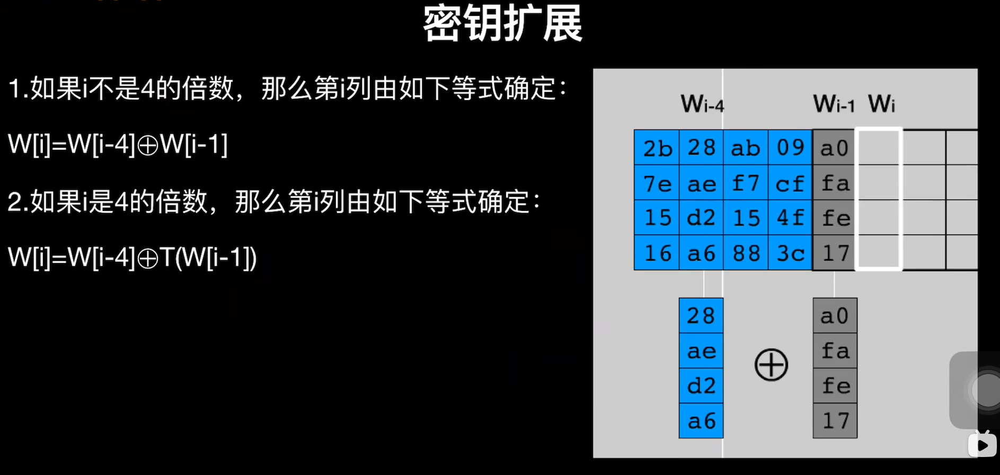

其中倍数为4的拓展更复杂  
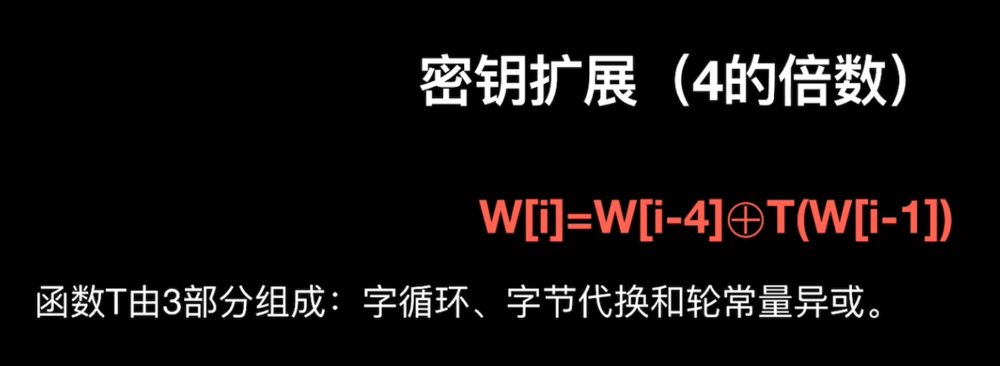

1. 字循环
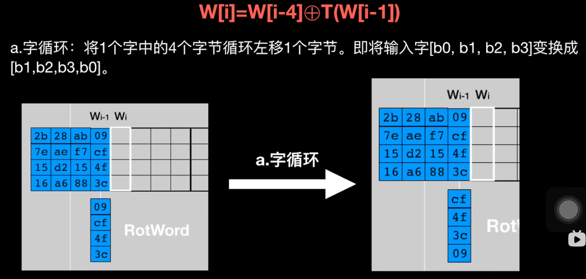

2. 字节代换
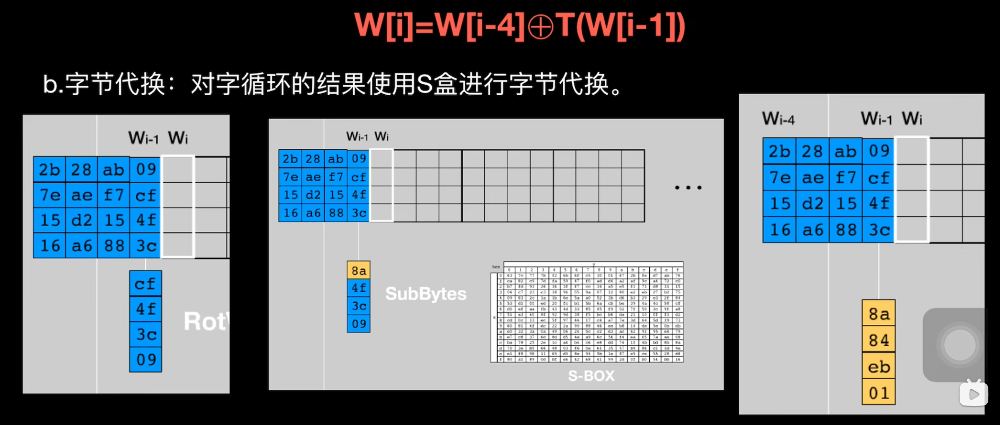
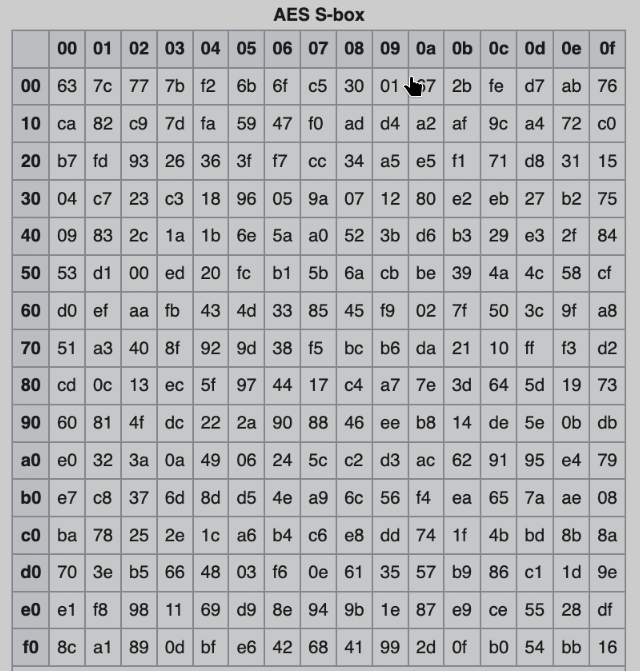

3. 轮常量异或

轮常量也是固定的，就是从1开始一直乘2，并且是在GF(2^8)内乘法  
并且除了第一个字节全部非零
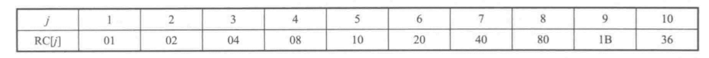

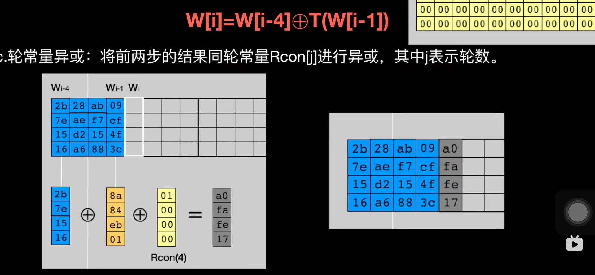

## 初始变换(轮密钥加)

将未经处理的明文和第1轮字密钥进行异或  
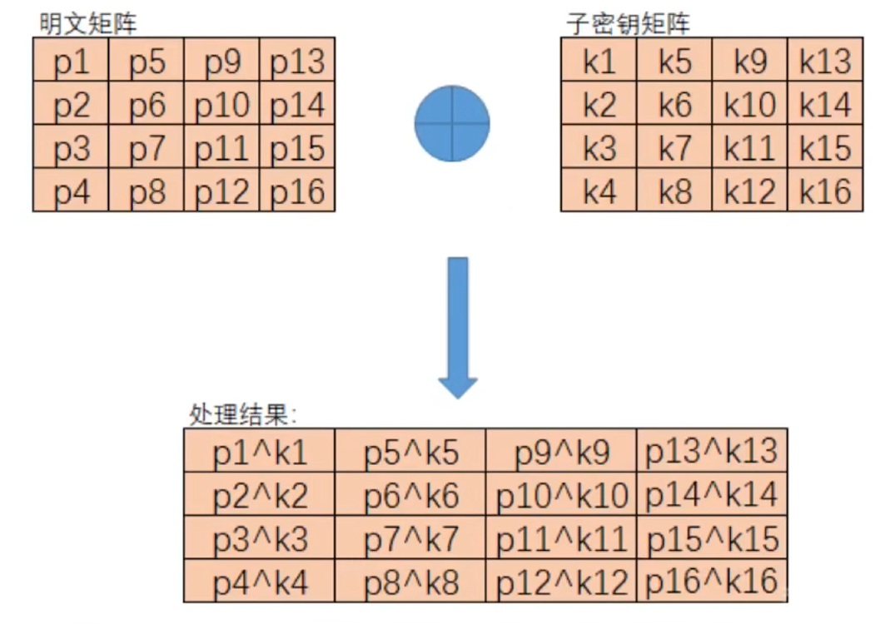

## 字节代换

从固定的s盒中查表，如果原值为0xf1，则从表中f行1列将值把表的0xf1替换  


## 行移位

第n行就向左移(n-1)位  
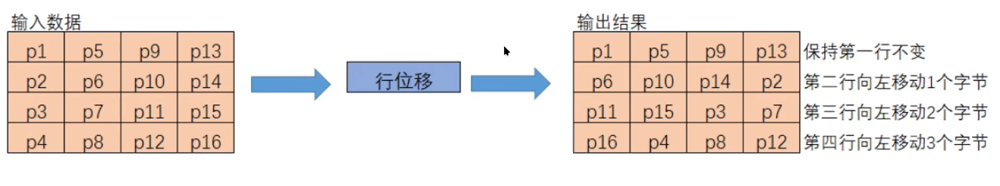

## 列混合

将固定矩阵左乘输入，这里是线性代数的矩阵乘法  
并且乘法是在GF(2^8)有限域下进行，最后再介绍  
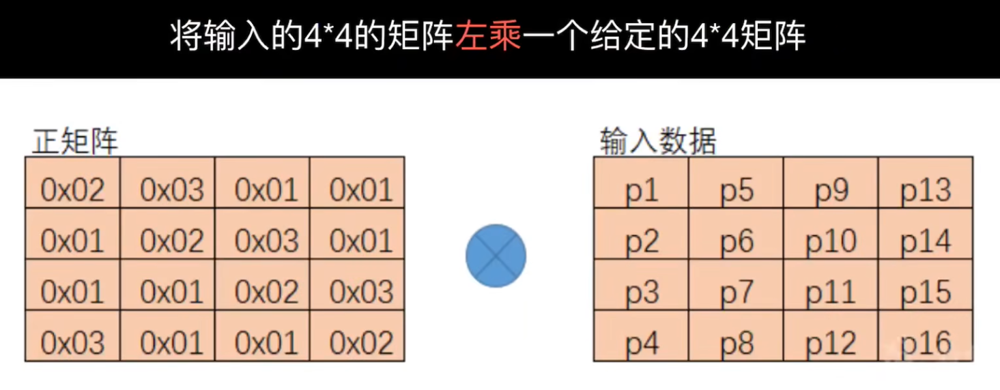
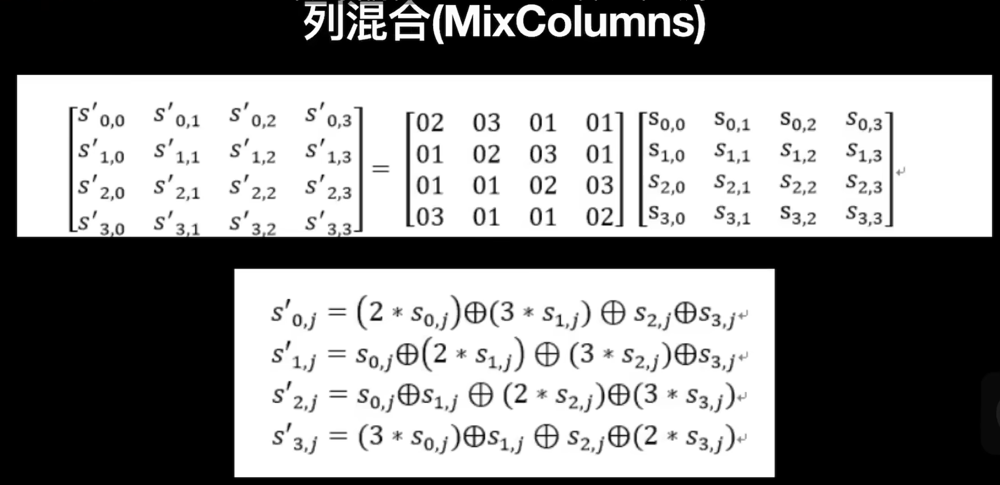

## 轮密钥加

> 见初始变换，算法一样，但是密钥要生成第二轮的

## GF(2^8)

加法运算全部替换成异或就行了

在GF(2^8)域内乘法运算法
乘以2的算法是明确的，可以用来推出乘以任何数的算法

```c
#include <stdint.h>
#include <stdio.h>

// return the result of a * 2 in GF(2^8)
uint8_t
GF_multiply_by_2 (uint8_t a)
{
  if (a & 0x80)
    return ((a << 1) & 0xff ^ 0x1b);
  else
    return a << 1;
}

// return the result of (a * b) in GF(2^8)
uint8_t
GF_multiply (uint8_t a, uint8_t b)
{
  uint8_t result = 0;
  // 遍历b的8bit
  for (uint32_t i = 0; i < 8; i++)
    {
      // 如果b的当前bit为1，则执行+a的操作
      // 伽罗瓦域内加法为异或，所以异或a
      if (b & 1)
        result ^= a;
      // 右移，下次循环寻找b的下一bit
      b >>= 1;
      //  由于b的位数正在提高，a也需要提高位数
      a = GF_multiply_by_2 (a);
    }
  return result;
}

uint32_t
normal_multiply (uint32_t a, uint32_t b)
{
  uint32_t result = 0;
  for (uint32_t i = 0; i < 8; i++)
    {
      if (b & 1)
        result += a;
      b >>= 1;
      a = a * 2;
    }
  return result;
}

int
main ()
{
  uint8_t a = 0x9b;
  uint8_t b = 3;

  printf ("GF_multiply result: 0x%x\n", GF_multiply (a, b));
  printf ("normal_multiply result: 0x%x\n", normal_multiply (a, b));
}
```

主要是加法和乘法，可以参考[这个](https://www.cnblogs.com/pitmanhuang/p/16175550.html)  
