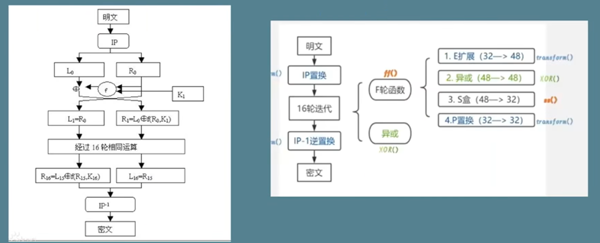
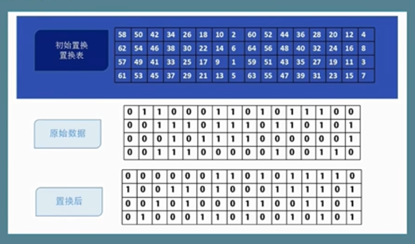
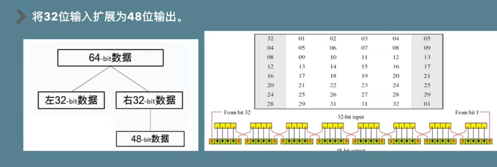
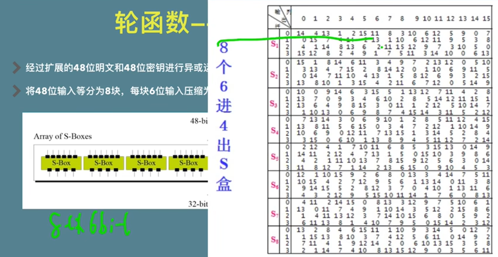
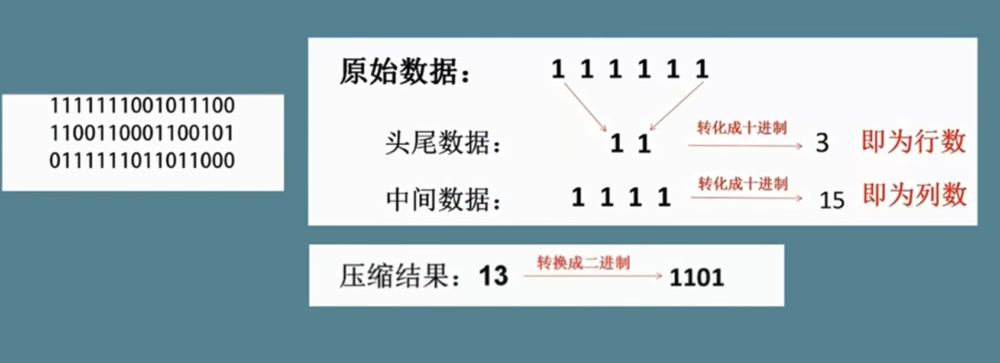
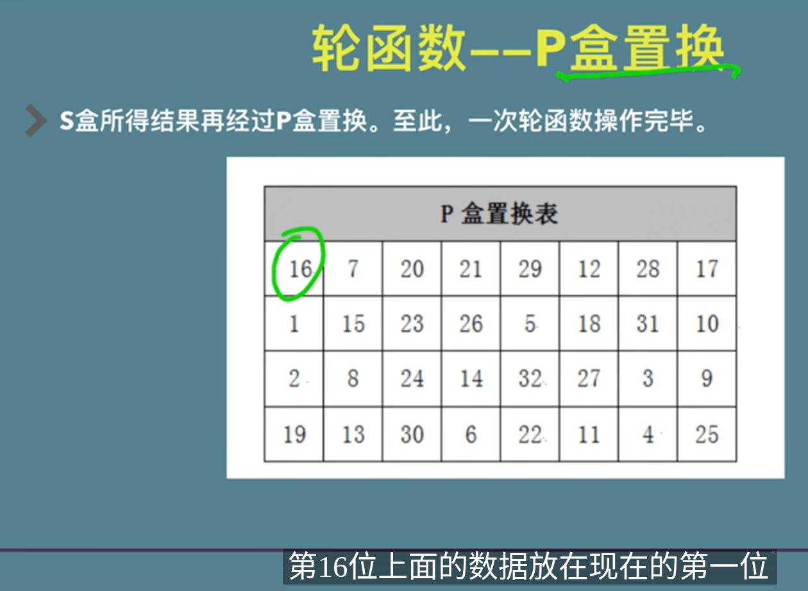
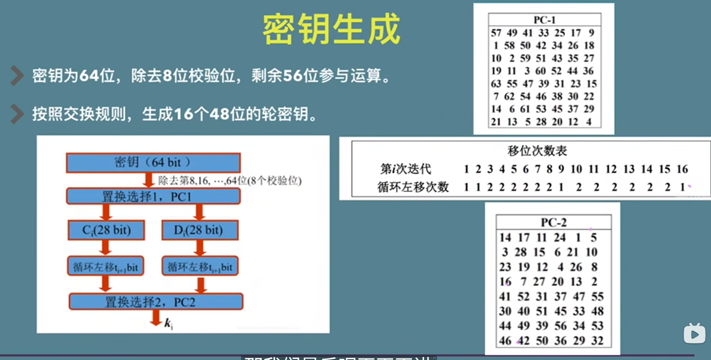
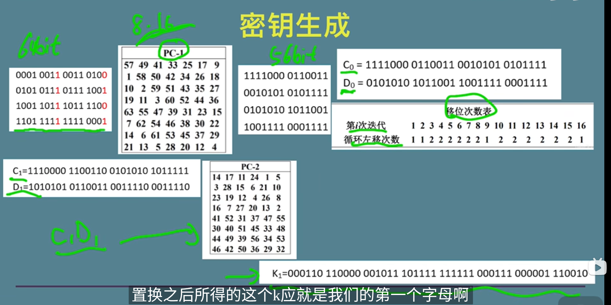

## des加密流程

其中ip置换是64bit整体置换
然后会将64bit拆分为两个32bit, L0和R0

原始密钥为64bit, 而轮密钥为48bit
其中原始密钥的8, 16, 24, 32, 40, 48, 56, 64bit位为校验位
实际参与生成轮密钥只有56bit

### IP置换

按照初始置换置换表来置换原始数据
例如置换表上(0, 0)的值是58, 则将(0, 0)的值放上原始数据第58的值

### E拓展

如图, 将32bit拓展至48bit

### 异或

将48bit经过处理的明文和48bit的轮密钥进行异或

### S盒压缩

在得到行号列号后由取s盒的第几行第几列数据, 再转换为二进制

### P盒置换

和初始置换一样, 只不过用P盒置换表

## 密钥生成

64bit原始密钥先去掉第8nbit
然后经过PC-1表进行置换, 在从移位次数表中得到移位次数进行移位
但是这里我感觉看结果C1是在C0基础右移了, D1在D0基础左移了
