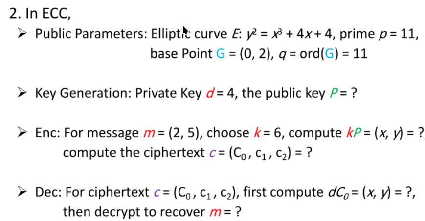

## 整体算法


m为消息明文

加密:
C0 = kG
C1 = kP
C2 = m + kP
两点相加的算法参考下面

解密:
m = C2 - d `*` C0
理论上`d * C0 == C1`
所以如果不想算可以直接把加密结果C1带入, 用C2 - C1来算

## 两点相加


这里是计算两点相加的公式, 这里计算(x3, y3) = P(x1, y1) + Q(x2, y2)

P(x1, y1)
Q(x2, y2)
如果P != Q, 那么k直接用两点连线即可
否则需要用切线来求, 可能用到导数知识, 这里应该背就行了

## 两点相减

```python
def point_neg(P: Point) -> Point:
    x, y = P
    return (x, (-y) % p)

def point_sub(P: Point, Q: Point) -> Point:
    return point_add(P, point_neg(Q))
```

### 小数mod


如果遇到小数mod, 参考这里来求

## 简化运算


如果遇到大倍数, 可以先拆成几个2的倍数, 然后求2^{1}, 2^{2}, ... ,2^{n}最后相加
