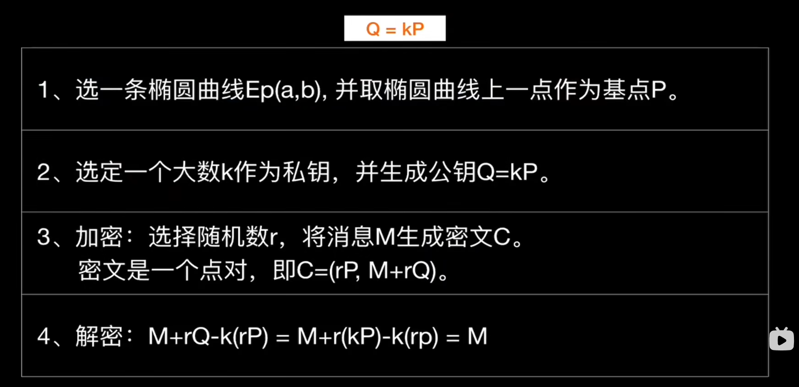
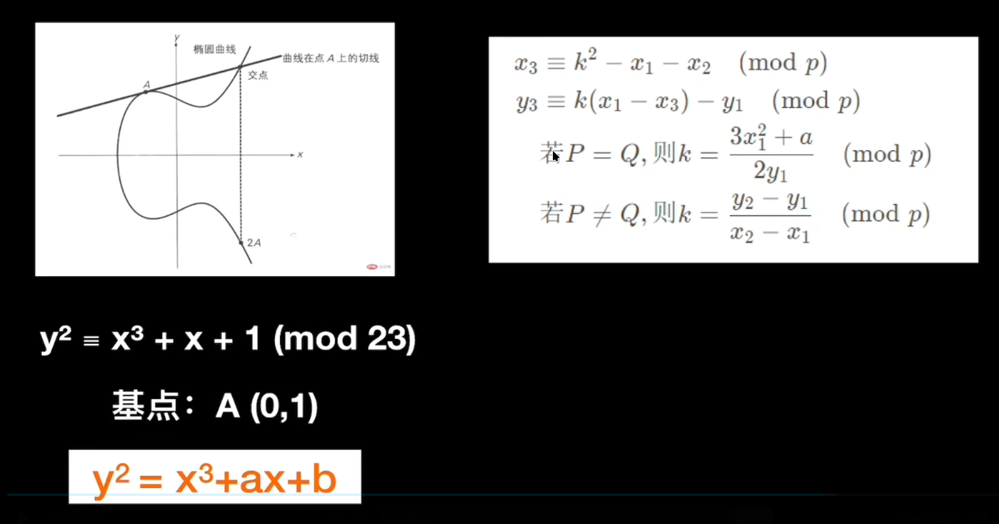
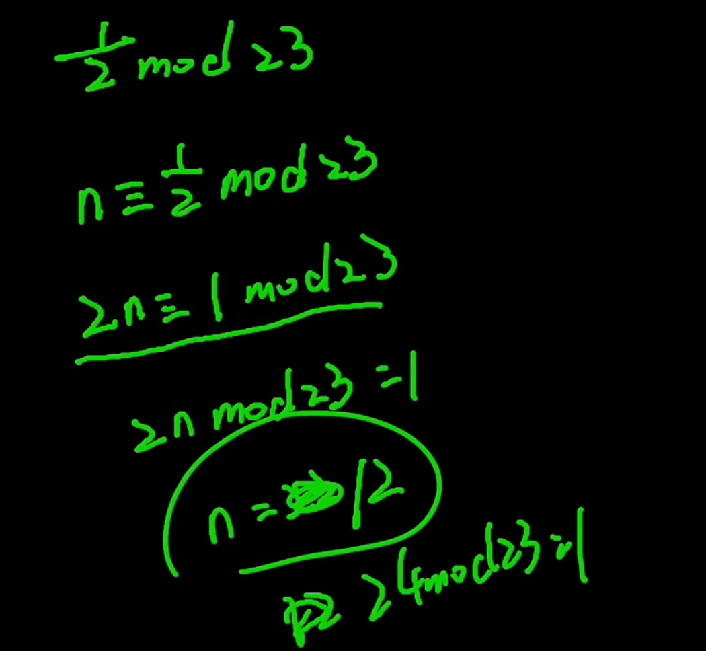
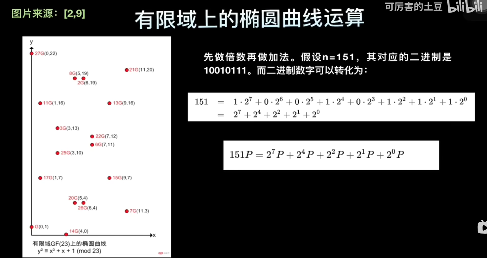

## 整体算法

Q=kP的算法参考下面

## 两点相加

这里是计算两点相加的公式, 这里计算(x3, y3) = P(x1, y1) + Q(x2, y2)

P(x1, y1)
Q(x2, y2)
如果P != Q, 那么k直接用两点连线即可
否则需要用切线来求, 可能用到导数知识, 这里应该背就行了

### 小数mod

如果遇到小数mod, 参考这里来求

## 简化运算

如果遇到大倍数, 可以先拆成几个2的倍数, 然后求2 ** 1, 2 ** 2, ... ,2 ** n最后相加

我搞得也不是很懂, 建议看看这个视频
[b站参考](https://www.bilibili.com/video/BV1v44y1b7Fd/?spm_id_from=333.1391.0.0&vd_source=9eda38a0d250e4f8363b1097a9c55fd1)
