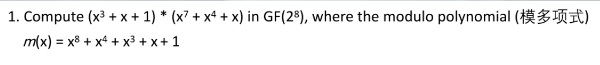

## LFSR

有两种表现形式, 多项式和反馈函数

多项式: f(x) = 1 + x + x^{4}
即f(x) = C0 * (x^{4}) + C1 * (x^{1}) + C4 * (x^{4})

反馈函数: C0 * a_{n+4} = 1 + C1 * a_{n+3} + C4 * a_{n}
这样可以由一个初始的值不断生成另外的值

如果想要判断一个序列是否属于m序列(m-sequence)
要看这个n-bit序列是否在出现重复前是否包含了所有n-bit的可能
例如3-bit的序列010 011 000 111 100 110 101 001为m-sequence

## 作业题

计算的时候要把+看成异或, 例如x^{2} + x^{2} = 0

再把所有的高于八阶的x分解为低于八阶的x和八阶本身
由于伽罗瓦域特性, x^{8}可以等于x^{0} + x^{1} + x^{3} + x^{4}
化为低阶再运算
