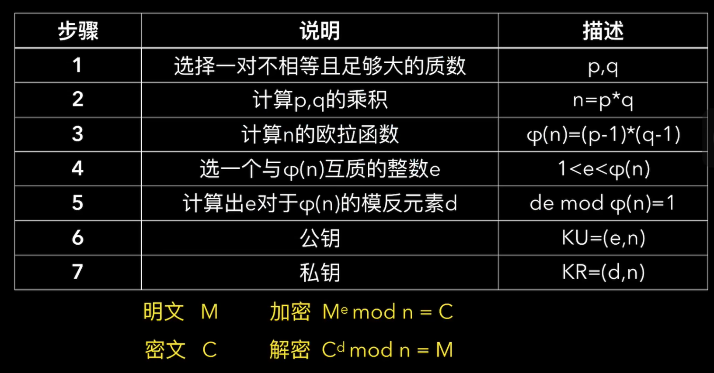

## rsa加密流程

3. euler (n) = euler (p) * euler (q)
然后因为p, q质数, 所以euler (p) = p - 1, euler (q) = q - 1

5. 计算一个d, 使得(d * e) mod euler(n) = 1

[参考视频](https://www.bilibili.com/video/BV1YQ4y1a7n1/?spm_id_from=333.1387.homepage.video_card.click&vd_source=9eda38a0d250e4f8363b1097a9c55fd1)
