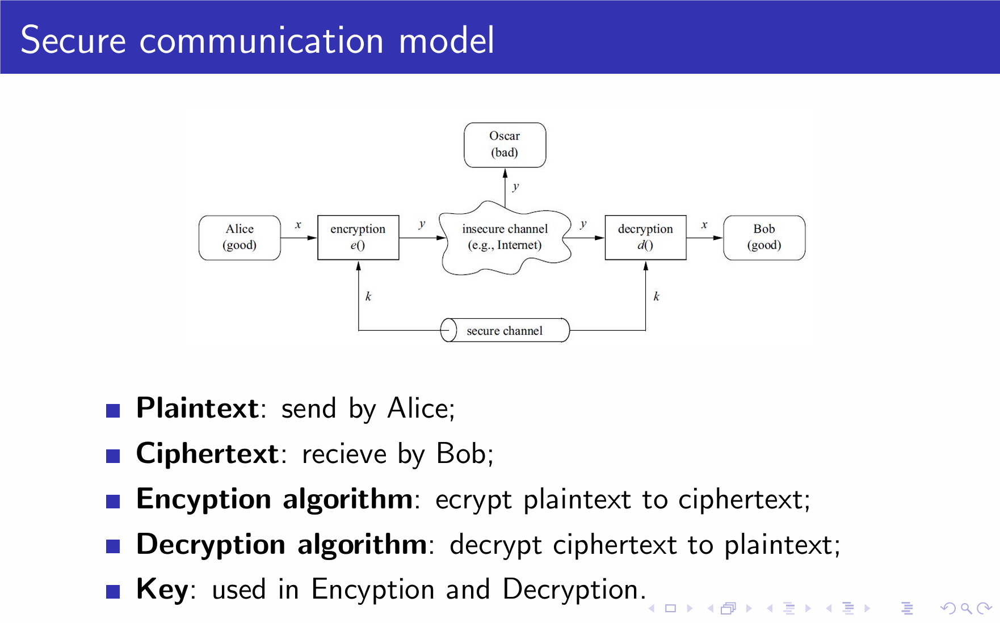
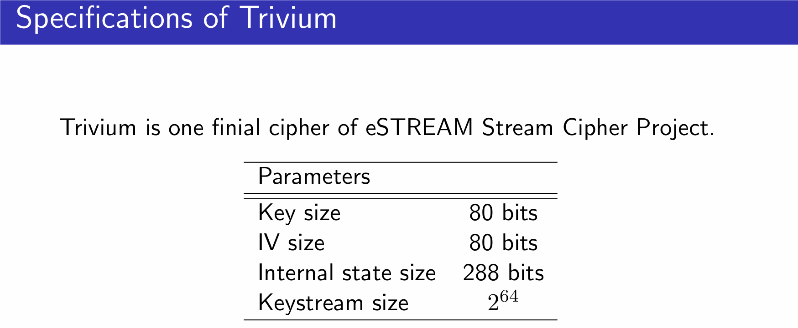
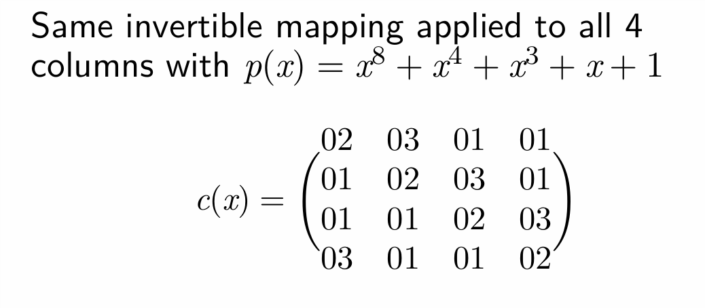
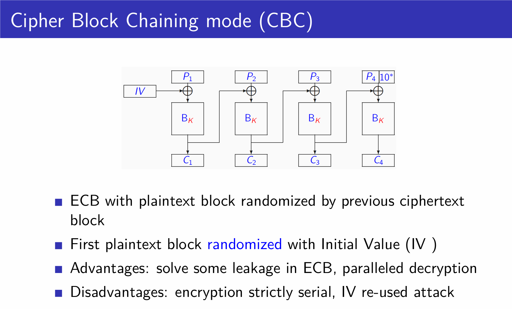
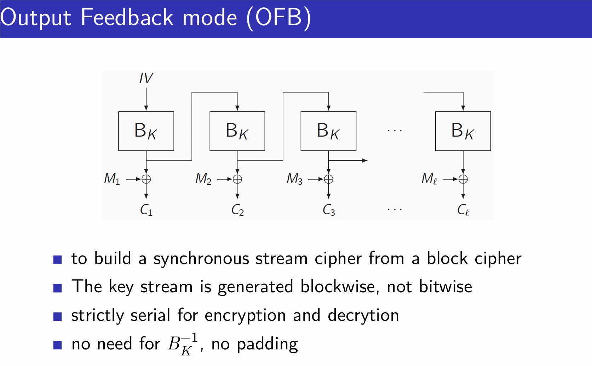
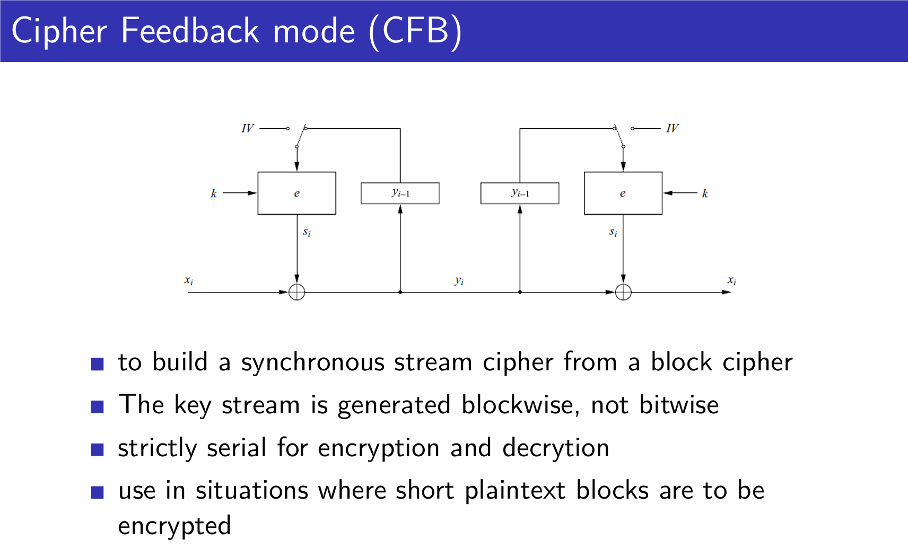
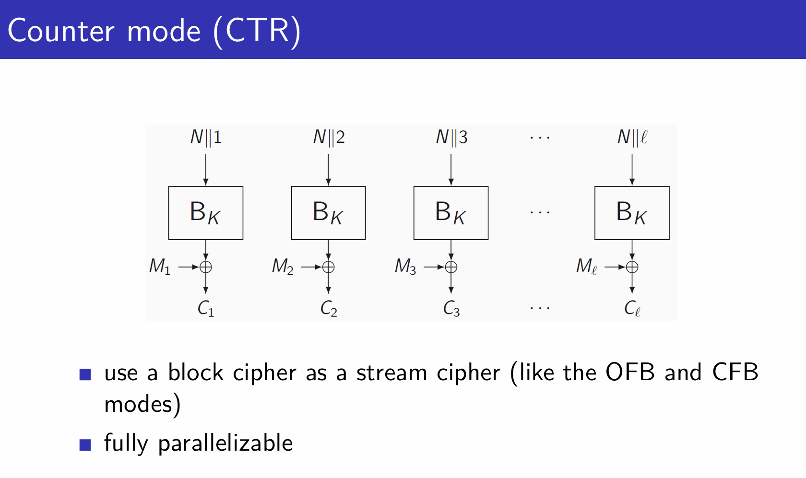
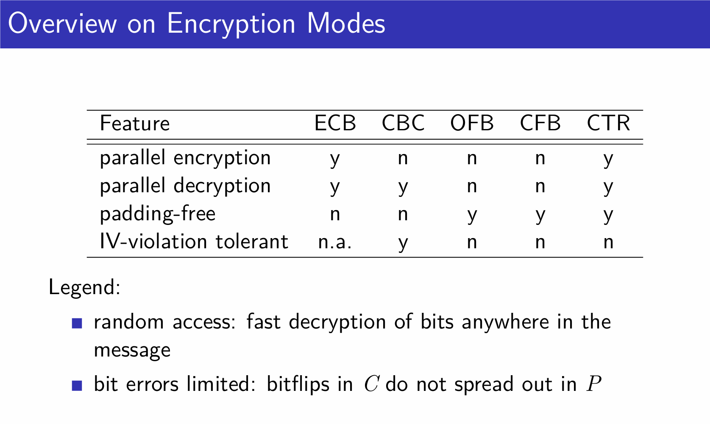
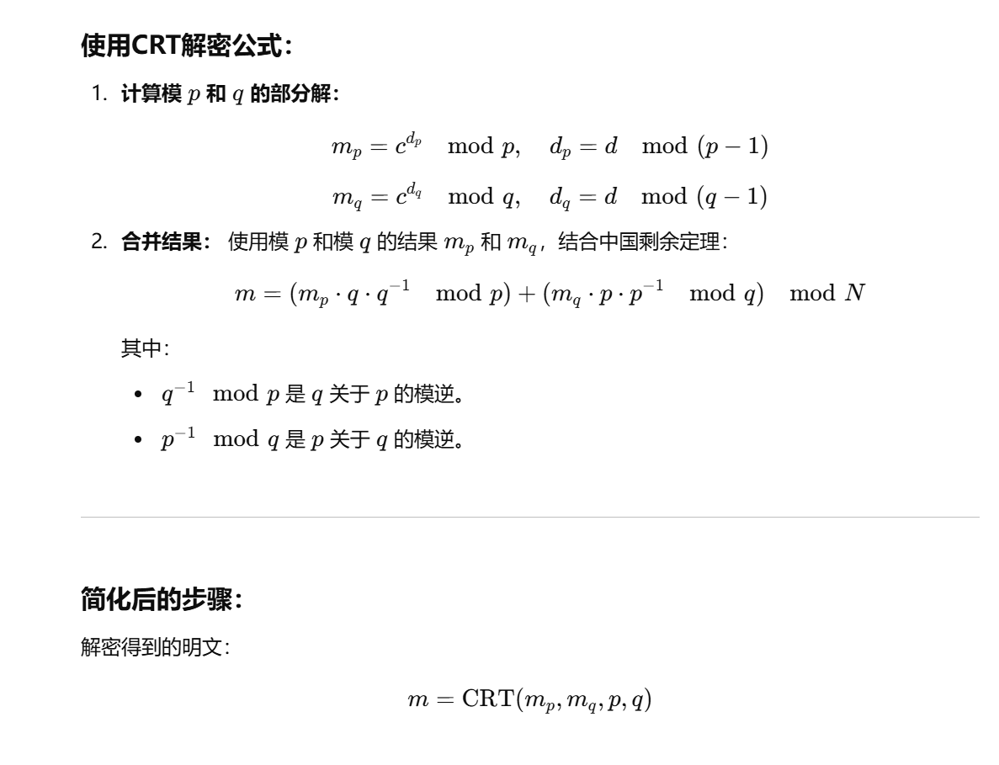

# Chapter 1

There is no mathematical proof of security for any **practial** cipher! ( cause OTP can not be implement)

**Kerckho `s Principle**: A crypto system should be secure even if the attacker knows all details about the system, with the exception of the **secretkey**.

A cipher is **NOT** more secure if its details are kept secret

crypto model and five key points

# Chapter 2 stream cipher

###  OTP is **Unconditionally** Secure, but it can not be implement

OTP needs:

1. a true RNG (TRNG) ——> a TRNG can not be predicted or reproducted
2. secure channel to transform key (hard to implement)
3. and the length of key is as long as the plaintext (too long, **major drawback**)

so we take a step back

### we use Pseudo random Number Generators (PRNG)

PRNGs should have bad cryptographic properties, hard to attack

take a step further  

 Cryptographically secure pseudo random number generators (**CSPRNGs**) are a special type of PRNG which is unpredictable.

####  Linear feedback shift registers (**LFSRs**)

The maximum sequence length generated by an LFSR of degree m is 2^m-1 (so must have sequence).

attack for LFSRs (Exhaustive Key Search, linear algebra )

### Trivium

btw, stream cipher must have IV

for forward securitya

# block cipher

two primitive points in block cipher 

**Confusion **: An encryption operation where the relationship between key and ciphertext is obscured.

**Diffusion**: An encryption operation where the influence of one plaintext symbol is spread over many ciphertext symbols.

but both of them do not offer security 

### DES

**blocksize**: 64 bits

**key length:** 56 (need to point out key length if 56, but will be expanded to 64)

**round:** 16

**construction:** Feistel network

**subkey size:** 48 bits

s-box offer nolinear, non-bijective , and s-box is irreversible

### AES

**blocksize**: 128 bits

**key length**: 128/192/256 bits

**rounds:** 10/12/14

AES has four layers

1. nonlinear layer: SubBytes consists of 16 s-boxs, bijective and reversible

2. Shuffing layer: ShiftRows for diffusion 要记具体移了多少反正第几行移几下 从0开始count
3. Mixinglayer: MixColumns 必考记住循环矩阵第一行 2311 1231 1123 3112
4. Round key addition: Add Round Key

#### SM4

####  Encryption with Block Ciphers: Modes of Operation

1 Electronic Code Book mode (ECB) 

2 Cipher Block Chaining mode (CBC) 

注意CBC的解密可以并行，但是加密只能串行，因为解密的时候拥有密文块

3 Output Feedback mode (OFB) 

4 Cipher Feedback mode (CFB) 

5 Counter mode (CTR) 

overall

# 公钥

RSA

CRT is the most important

# digital signature数字签名

主要是为了抗抵赖，并没有加密

